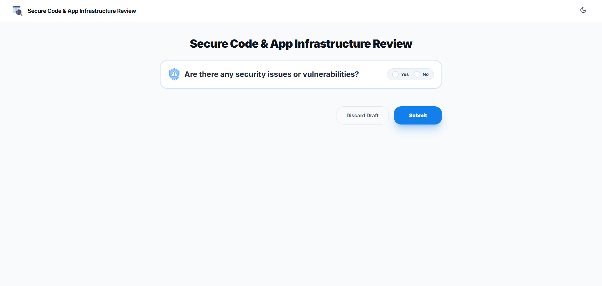
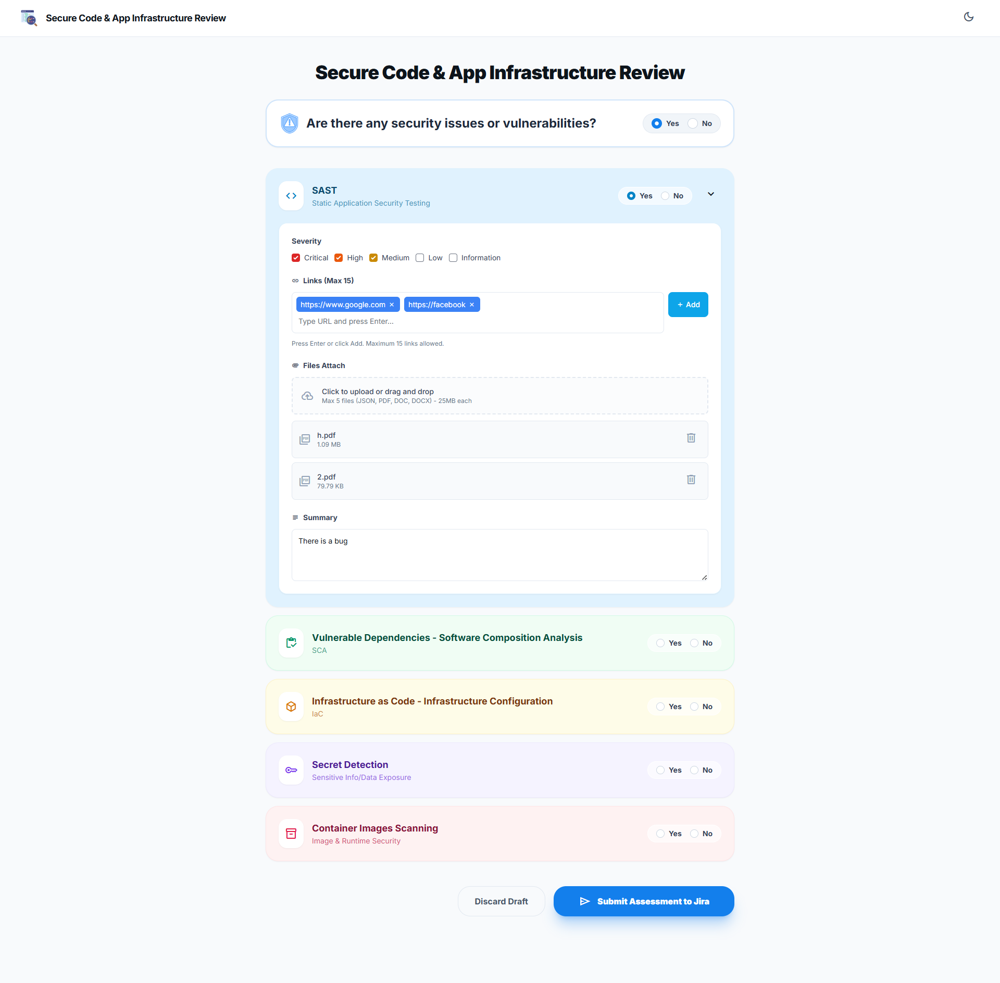
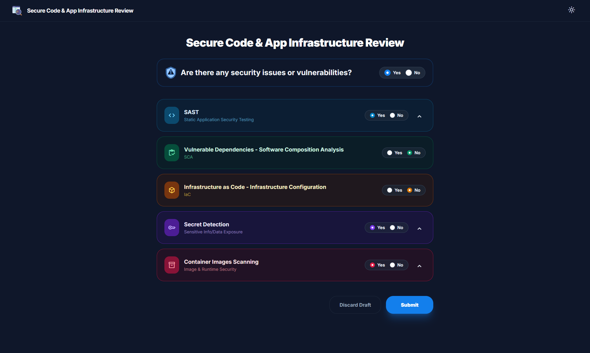

# Secure Code & App Infrastructure Review — Jira Forge App

A Jira project page built with Atlassian Forge and React that lets developers submit structured security assessments directly inside their Jira project.

## Demo

### Assessment Form


### Security Sections — Expanded


### Dark Mode


---

## Overview

This app adds a **Project Page** to any Jira project. Team members use it to report findings across five security scanning categories:

| Category | Description |
|---|---|
| SAST | Static Application Security Testing |
| SCA | Software Composition Analysis (vulnerable dependencies) |
| IaC | Infrastructure as Code configuration review |
| Secret Detection | Sensitive data / credential exposure |
| Container Images | GitLab CI static scanning + Sysdig runtime scanning |

Each user can submit **one assessment per project**. After submission the app creates a Jira issue in the project backlog and stores attached files as Jira attachments. All submitted assessments are visible to everyone in the project, and reviewers can leave per-section comments.

## Features

- **Security assessment form** with five collapsible sections
- **Severity tagging** per section (Information → Critical)
- **Link and file attachments** (JSON, PDF, DOC, DOCX — up to 5 files × 5 MB each)
- **GitLab CI and Sysdig sub-sections** inside Container scanning
- **Auto-save draft** every 2 seconds while filling the form
- **One submission per user** enforced by Forge Storage + account ID
- **Assessment list view** — all submissions for the current project
- **Feedback / detail view** — read-only view of any submission with downloadable attachments and per-section comments
- **Dark mode** with localStorage persistence

## Tech Stack

| Layer | Technology |
|---|---|
| Platform | Atlassian Forge (Custom UI) |
| Backend | Node.js 24 resolver (`src/index.js`) |
| Frontend | React 16, Tailwind CSS 3, FontAwesome 6 |
| Storage | Forge Storage (key-value) |
| Jira API | Jira REST API v3 via `@forge/api` |

## Project Structure

```
├── src/
│   └── index.js                  # Forge resolver (all backend handlers)
├── static/ui/
│   ├── public/
│   │   └── index.html
│   └── src/
│       ├── App.js                # Root component — state management + routing
│       ├── App.css               # Global styles (accordion, toast, spinner, tags)
│       ├── index.js              # React entry point
│       ├── constants/
│       │   └── sections.js       # SECTION_CONFIG, SECTIONS, SEVERITIES, MAX_* constants
│       ├── utils/
│       │   ├── fileUtils.js      # formatFileSize, getFileIcon
│       │   └── severityUtils.js  # getSeverityColor, getSeverityCheckboxClass
│       ├── components/
│       │   ├── AppHeader.js      # Sticky header with nav + dark mode toggle
│       │   ├── Toast.js          # Toast notification
│       │   ├── AlreadySubmitted.js   # Shown when user has an existing submission
│       │   ├── ConfirmSubmitModal.js # Pre-submit review modal
│       │   ├── SectionCard.js    # Collapsible accordion card per security section
│       │   └── ContainerScanners.js  # GitLab CI + Sysdig sub-sections
│       └── views/
│           ├── FormView.js           # Assessment submission form
│           ├── AssessmentListView.js # List of all project assessments
│           └── FeedbackView.js       # Read-only detail view with comments
├── manifest.yml                  # Forge app manifest
└── package.json
```

## Getting Started

### Prerequisites

- [Atlassian Forge CLI](https://developer.atlassian.com/platform/forge/set-up-forge/) installed and authenticated
- Node.js 18+

### Install Dependencies

```bash
# Root (Forge resolver)
npm install

# React frontend
cd static/ui
npm install
```

### Development

```bash
# Build the React frontend
cd static/ui
npm run build

# Deploy to Forge
forge deploy

# Install on a Jira site (first time only)
forge install
```

After the first install, subsequent `forge deploy` calls are picked up automatically — no re-install needed.

### Local Tunnelling (optional)

```bash
forge tunnel
```

This runs a local dev server and proxies Forge resolver calls — useful for backend iteration without a full deploy.

## Permissions

The app requires the following Jira OAuth scopes:

| Scope | Purpose |
|---|---|
| `read:jira-work` | Read project and issue data |
| `write:jira-work` | Create issues and upload attachments |
| `read:jira-user` | Get current user info for comments and submission ownership |
| `manage:jira-project` | Access project metadata |
| `storage:app` | Forge Storage for assessments, drafts, and comments |

## Backend Resolver Endpoints

| Handler | Description |
|---|---|
| `getProjectInfo` | Returns current project key and name |
| `getCurrentUser` | Returns logged-in user's display name, email, accountId |
| `checkUserSubmission` | Checks if current user already submitted for this project |
| `submitAssessment` | Saves assessment, creates Jira issue, uploads file attachments |
| `deleteAssessment` | Deletes submitter's own assessment (owner-only) |
| `getAssessment` | Fetches a single assessment by ID |
| `getAllAssessments` | Lists all assessments for the current project |
| `saveDraft` / `loadDraft` / `clearDraft` | Auto-save draft management |
| `addComment` / `getComments` | Per-section comments on an assessment |
| `getIssueAttachments` | Lists attachments on the linked Jira issue |
| `downloadAttachment` | Downloads an attachment and returns it as base64 |
